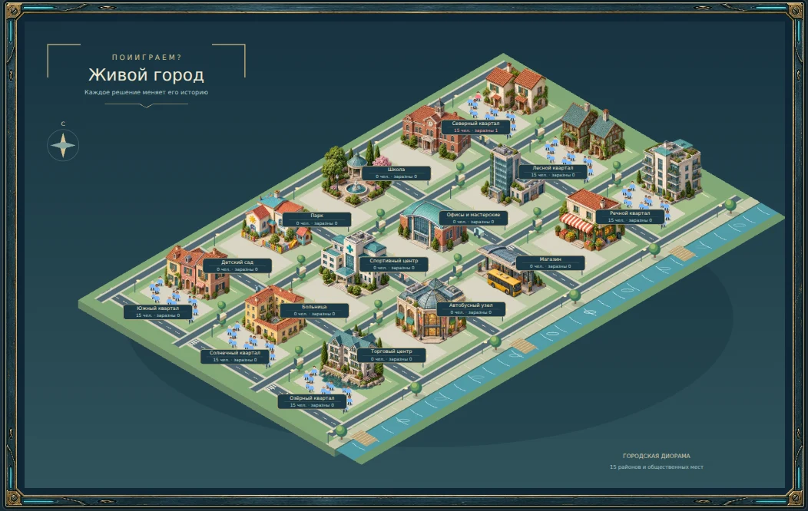

# Painted city buildings

15 individual alpha-transparent WebP sprites generated with the built-in imagegen tool. The map now uses this painted artwork instead of procedural building polygons. Filenames match `Epidemic.places` IDs; `paintedBuilding()` in `epidemic.html` controls placement and scale. Houses, public facilities and the park each have their own sprite.

The generated 4 × 4 atlas was split along transparent gutters, cropped to each sprite's alpha bounds with a two-pixel margin, and encoded as WebP at quality 90 with full alpha quality. No facade or texture was drawn procedurally. The sixteenth library sprite was not needed by the existing game and was omitted. The 15 deployed sprites total approximately 600 KiB.

The existing scene projection, resident locations, simulation, keyboard controls and depth sorting are retained. An image load failure displays a clickable place-name placeholder. Closed locations dim the artwork. The existing Pages workflow copies this directory through `assets/`.

## Generation prompt

Use case: stylized-concept. Production asset: transparent isometric city-building sprite atlas for a polished educational city-management videogame. Create exactly 16 isolated sprites arranged in a STRICT evenly spaced 4 columns by 4 rows grid, square canvas 2048x2048. Each cell is exactly 512x512, building centered in its own cell, all pixels within x/y 48..464 of that cell with generous TRANSPARENT gutters. Real alpha transparency behind and between all buildings, not a painted checkerboard, no colored backdrop. Consistent orthographic isometric camera, both ground axes 30 degrees from horizontal, roofs visible from above, no perspective convergence. Beautiful richly detailed hand-painted 3D strategy game art, realistic miniature materials, warm terracotta and cream masonry, muted teal roofs, textured brickwork, window frames and reflective glass, subtle weathering, individual roof tiles, chimneys, rooftop equipment, architectural details; soft upper-left sunlight, no long cast shadows. Buildings only, tiny attached entrance steps allowed, NO diamond ground tiles, NO broad ground slabs, NO roads, NO people, NO labels, NO typography, NO UI. Buildings medium-wide footprints, tidy compact silhouettes; each full sprite including roof must be inside its cell. EXACT row-major contents: row 1: (1) cozy cream two-storey terracotta-roof cottage pair, (2) timber-and-sage woodland cottage pair, (3) modern riverside midrise apartment building with balconies and teal roof, (4) three connected warm pastel townhouses. Row 2: (5) sunny pale-yellow courtyard apartment block, (6) light stone lakeside apartment villa with teal gabled roofs, (7) brick school with a small clock over entrance and red tiled pitched roof, (8) contemporary office tower with glass facade and a low workshop wing. Row 3: (9) small grocery store with striped cream-and-terracotta awning and produce crates, (10) lush tiny park pavilion with a fountain and surrounding trees as one compact sprite, (11) sports hall with arched copper-teal roof and tall glazed entrance, (12) compact bus terminal canopy with one mustard-yellow bus. Row 4: (13) cheerful pastel kindergarten with colorful low roof and tiny attached playhouse, (14) white and teal hospital with a simple teal medical plus symbol, (15) shopping gallery with beautiful glass skylight roof, (16) small red-brick civic library with stone entrance. All 16 visually distinct and equally polished, coherent scale, crisp quality when reduced to 160 pixels wide. The entire artwork must be an actual alpha-transparent game sprite sheet.

## In-game preview

