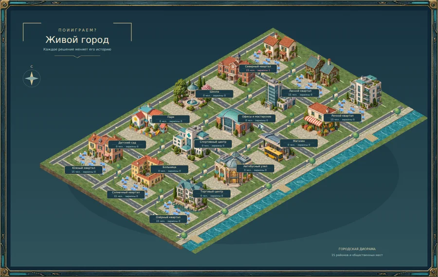
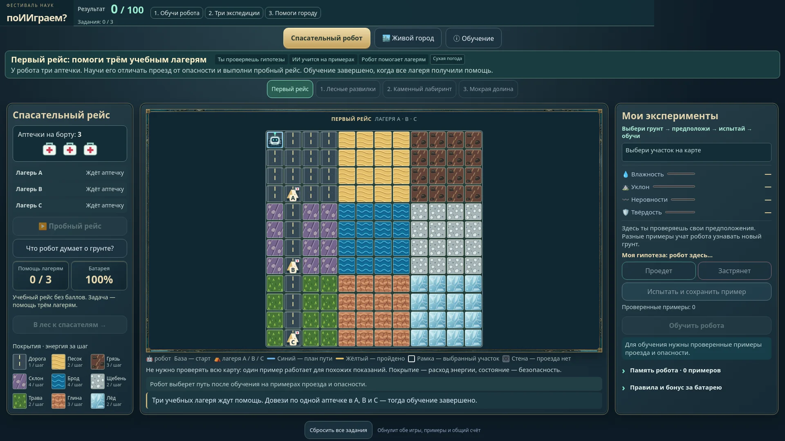

# Ground materials

`materials.webp` is a 768 × 768 raster atlas generated with the built-in imagegen tool and encoded as WebP at quality 86. Each of its nine tiles is 256 × 256. The city uses this cached file (about 225 KiB).

| Row | Left | Center | Right |
| --- | --- | --- | --- |
| 1 | Grass | Asphalt | Limestone paving |
| 2 | Mud | Sand | Water |
| 3 | Stone wall | Rocky hills | Gravel road |

The city uses cropped SVG patterns aligned to its existing ground projection. Base colors remain behind the images as a fallback. Lane markings, crossings, buildings and residents stay separate.

The robot uses separate authored SVG textures with distinct colors and large patterns readable on a 27-inch monitor:

| Surface | Texture |
| --- | --- |
| Road | Dark asphalt with yellow lane markings (`road.svg`) |
| Grass | Green blades (`grass.svg`) |
| Sand | Golden waves (`sand.svg`) |
| Mud | Brown puddles (`mud.svg`) |
| Water | Blue ripples (`water.svg`) |
| Hill | Purple rock contours (`hill.svg`) |
| Gravel | Pale gray pebbles (`gravel.svg`) |
| Clay | Orange fissures (`clay.svg`) |
| Ice | Cyan fractures (`ice.svg`) |
| Wall | Masonry blocks, impassable (`wall.svg`) |

The route game uses six of these authored textures on the road ribbons: mud, water, gravel, sand and hill, plus the painted asphalt tile from `materials.webp`. Asphalt lane markings follow each road's curve. Legend swatches use the same patterns. Surface and wheel state together determine energy, wheel changes and possible stalling; neither the decoration nor a texture reveals the hidden effects. Forecast, return and travelled paths remain separate layers above the surfaces.

Generation used the following prompt. Subsequent processing only resized the complete atlas and encoded WebP.

Use case: stylized-concept. Create a production game terrain TEXTURE ATLAS, square 1536x1536 canvas, STRICT 3 columns by 3 rows of equally sized square tiles (512 pixels per tile). Each of the NINE materials fills its exact square edge to edge. NO gutters, NO borders, NO frames, NO labels, NO objects, NO transparency. Orthographic straight TOP DOWN view, not isometric, no horizon, no side faces. Hand-painted premium city-builder game materials with refined miniature-realistic details, soft evenly distributed daylight, coherent natural muted palette, medium contrast so characters and UI can remain legible. Each tile should repeat seamlessly, with consistent color at its own four edges, no vignette or edge shadows. EXACT row-major order: TOP LEFT: rich muted sage green meadow lawn with fine varied grass blades and tiny clover, no large bushes. TOP CENTER: fine blue-gray asphalt, granular weathered road surface with subtle hairline wear, NO painted lines or lane markings. TOP RIGHT: warm cream limestone pedestrian paving of small irregular rectangular stones, delicate joints, subtle age and moss. MIDDLE LEFT: damp dark warm brown churned earth, small muddy puddles and shallow tire impressions, not black. MIDDLE CENTER: golden beige fine desert sand with delicate windswept ripples, no stones. MIDDLE RIGHT: clear teal-blue water viewed directly above, gentle ripples and light caustics, evenly colored edge to edge, no shoreline. BOTTOM LEFT: chunky cool gray stone masonry blocks, close-up top surfaces, tight dark mortar seams, subtle stone grain, clearly recognizable as an impassable solid wall material. BOTTOM CENTER: rugged mossy rocky hill terrain viewed top down, clusters of angular gray rock ridges breaking through olive green ground, detailed rock striations and coherent soft relief lighting, not a single freestanding mountain. BOTTOM RIGHT: compacted pale sage-gray gravel path, crushed stone grit and small pale pebbles in hard earth, gentle wheel wear, clearly drivable ground. Nine distinct tiles ONLY, align exact 3x3 boundaries without mixing neighboring materials. High-quality believable surface art to pair with detailed isometric European town building sprites.

## In-game previews

