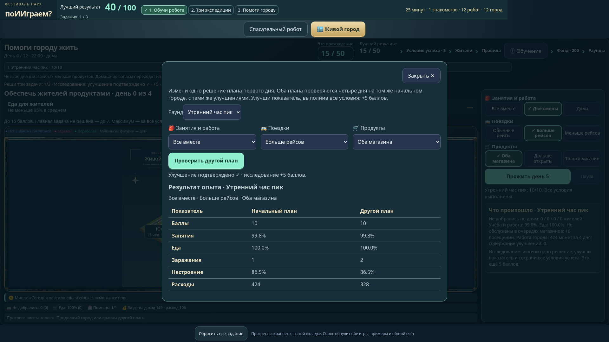

# Оценка фестивального интерфейса

Обновление 08.10.2026: робот выезжает с тремя аптечками и самостоятельно планирует помощь трём лагерям по обученной модели, город показывает понятные цели и позволяет перераспределять монеты. Основной экран рассчитан на 27-дюймовый монитор с Full HD или QHD.

## Что изменено

- Обучение робота проходит через выбор грунта, свою гипотезу, физическую проверку и обучение на проверенном результате. Свечение выделяет действие без затемнения. Пропуск, Esc и повторное обучение доступны. Галочка завершения и лесная экспедиция открываются после настоящего успешного рейса.
- Убраны редактор полигона, ручной порядок лагерей и пункты для ведущего. База фиксирована, чтобы доставку нельзя было упростить перестановкой робота. Общий сброс находится в самом низу после игр.
- Девять покрытий различаются контрастным цветом и крупным рисунком: разметка, стебли, волны, лужи, камни, трещины. Легенда использует те же текстуры, что карта. Каждое покрытие имеет безопасные и опасные варианты. Незнакомые показания получают знак «?». Неполное или ошибочное обучение действительно влияет на доставку. После дождя нужны новые примеры.
- Кнопка «Что робот думает о грунте?» включает маленькие значки с собственной легендой; журнал объясняет решение через похожие примеры. Новые проверенные примеры явно ждут переобучения; до него рейс заблокирован.
- На основном экране объяснён перенос опыта: один пример работает для похожих показаний; проверять всю карту не требуется. Процесс начинается с выбора грунта, поэтому первое самостоятельное действие видно без обучения.
- Успешный учебный рейс меняет заголовок на «Победа!»; в экспедиции к доставке добавлены две проверки переноса, учебный результат явно не приносит баллов. Повторный запуск подписан «Повторить рейс». Завершённый путь описан как жёлтый след, сообщения больше не обещают синий план после доставки.
- Робот, фиксированная база, выбранная клетка и непроходимые стены объяснены в легенде. База остаётся подписанной после отъезда робота.
- Аптечки видны на борту, палатки A/B/C остаются на карте после получения помощи, рядом — состояния лагерей. Синий сплошной путь показывает план, жёлтый — уже пройденный путь. Состояние грунта описано словами, точные показания доступны в дополнительных пояснениях.
- Три поля имеют несколько вариантов пути. Робот сам оптимизирует доставку по своей модели; максимальные баллы требуют точного физически безопасного минимума. [Правила робота](ROBOT_MISSIONS.md).
- Город предлагает три раунда по четыре дня и остановку после каждого дня. Над картой видны словами сформулированные цели, текущие значения и выполнение. Между днями вложения можно вернуть и перераспределить; история не пересчитывается. [Правила города](CITY_CAMPAIGN.md).
- Эмоции жителей объясняют конкретные события показанного дня. По нажатию доступны семья, запасы, настроение, энергия и пройденный маршрут. Будущие цели доступны заранее.
- Сохраняется общий результат 0–100 и выполнение трёх заданий. Скорость прохождения не входит в баллы. Дополнительные сведения открываются в диалогах; основные действия и карта видны вместе на мониторе.

## Исправления после повторного ревью

- Жители доступны из меню с первого открытия. Нажатие на жителя во время движения ставит анимацию на паузу; карточка и маршрут относятся к показанному кадру.
- Парк и спортцентр открывают сведения об отдыхе, вместимости и холоде. Исчезло обещание отсутствующей настройки.
- Названия зданий имеют фактический размер 14–16 пикселей, посещаемость — 12–14. Проверяется отсутствие пересечений и обрезанного текста внутри подписей, вся карта видна.
- Безопасная и опасная глина различаются словесной влажностью. Испытание объясняет сочетание влажности и ям.
- Лес вводит пять покрытий вместо девяти сразу. Наблюдения можно передать модели вместе; обучение показывает реальное изменение решения на похожем грунте.
- Каменный лабиринт требует нового полевого наблюдения осыпи. Лабораторного набора недостаточно, одного подходящего опыта достаточно для переноса на похожие проходы.
- В городе выделена одна главная задача раунда; все требования для максимума доступны в «Условиях успеха». Частичный результат сопровождается списком невыполненных требований.
- Текущий счёт и лучший подписаны отдельно. Фонд 200 монет отделён от расходов работы города и его кассы.

## Исправления для площадки 25 минут

- В учебном наблюдении города разрешены осмотр движущихся жителей, карточки, пауза и продолжение. Закрытие карточки не завершает обучение; подсказка не перекрывает кнопку продолжения.
- До появления обращений помощь показывается словами без «100% ✓»; в отчётах и сравнении отсутствие обращений тоже подписано явно.
- Память робота показывает состояния датчиков в каждом примере и незнакомые показания на текущей карте. Легенда леса содержит пять реально присутствующих покрытий.
- Каждый городской раунд заканчивается фактическим разбором последствий. Отдельный опыт сравнивает альтернативный план на том же исходном городе с теми же вложениями и возвратами; основной результат сохраняется. Оба сравниваемых плана постоянны все четыре дня; изменяется одно решение. Успешное улучшение при выполнении всех условий даёт 5 баллов и входит в цель задания.
- Обе игры и общий счёт восстанавливаются после перезагрузки в той же вкладке. Прерванный городской день остаётся на паузе; общий сброс начинает чистую сессию нового участника.
- Расписание 1 + 12 + 12 постоянно видно в общей панели. В блок робота входят обучение, три местности, повторные рейсы и объяснение переноса опыта; в блок города — обучение, три раунда, сравнение планов и объяснение последствий. Жёсткого таймера нет.

## Исправления механического прохождения

- Доставка сама по себе не подтверждает понимание обучения. Каждая экспедиция требует подтверждённых гипотез проезда и опасности по другим примерам. Испытание сохраняет физический ответ, но ошибочная гипотеза не засчитывается как доказательство переноса. Ошибки бесплатны.
- Городские раунды дают 10/15/20 баллов, исследование — 5. Без главной задачи раунд ограничен половиной баллов; три задачи и исследование необходимы для отметки завершения. План без решений даёт 22/50, только частые автобусы — 27/50.
- Выбор новых вариантов удаляет старую таблицу; рассчитанный план подписан. После перезагрузки восстанавливаются итоги дня/раунда и подтверждённое исследование. Старые сохранения пересчитываются по новым правилам.

## Оставшиеся ограничения

Это проектная оценка без наблюдения за реальными школьниками. Площадка — 25 минут: 1 минута знакомства, 12 минут на робота и 12 минут на город; без решений городская анимация занимает около 100 секунд. Скорость чтения, самостоятельное исследование и интерес нужно проверить с небольшой группой.

У города фиксированная карта без свободного размещения зданий; оценивается один воспроизводимый сценарий, а не устойчивость ко всем возможным вспышкам.

## Проверка

Модельные тесты независимо проверяют оптимальный путь, зависимость от обучения, дождь, гипотезы и исправление ошибочного предположения, цели города, возврат монет и баллы. Браузерные тесты проходят оба обучения, три доставки и три раунда, общий счёт 100/100, сброс, паузу, эмоции, осмотр в обучении, сравнение решений и перезагрузку посреди рейса/дня. Проверены Full HD 1920×1080 и QHD 2560×1440: обе игры проходят целиком, элементы видны без прокрутки. Фактический итог проверок указан в PR; снимки сохраняются в артефакте CI.
